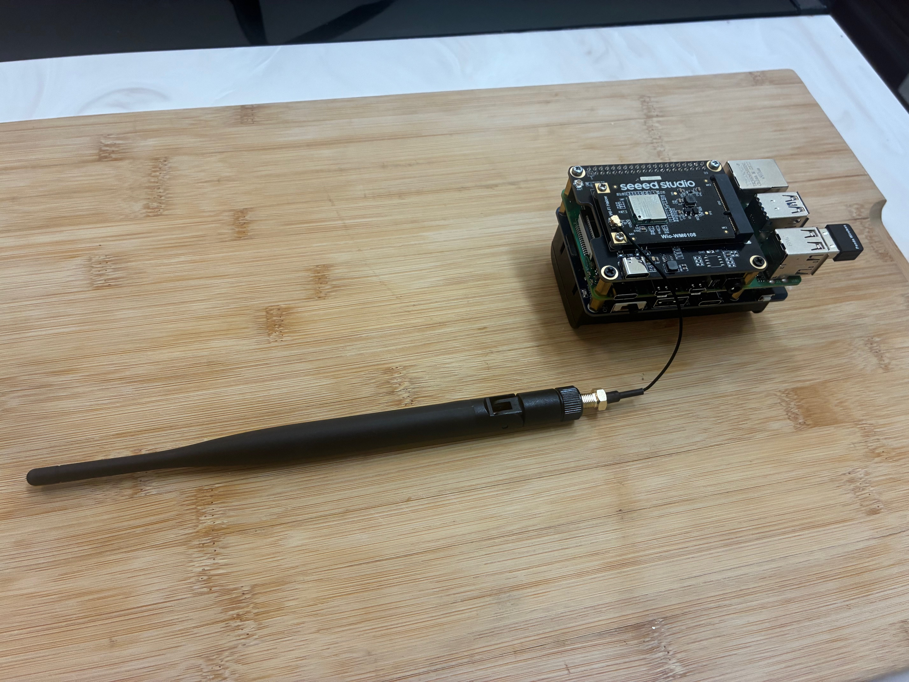
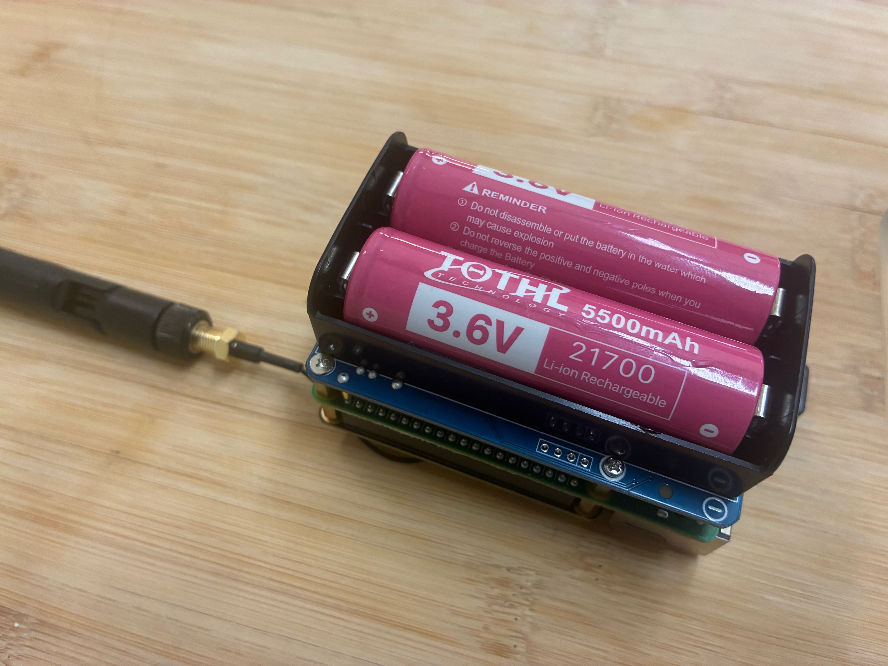
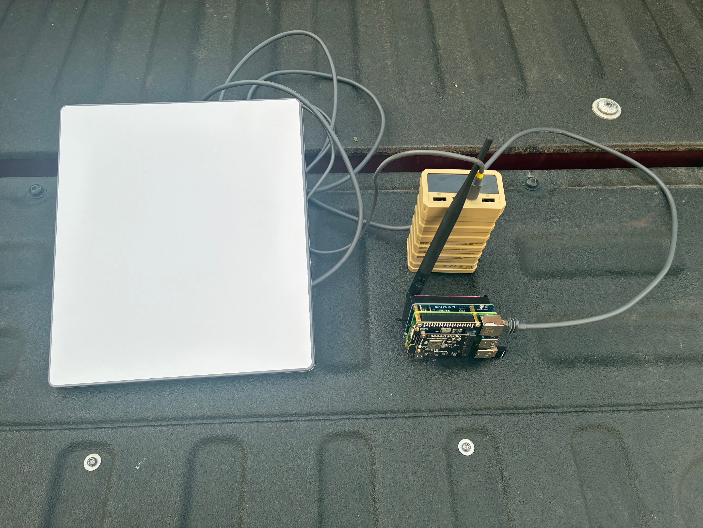

# OpenMANET Project

## Description
This project is still in its early stages, but the goal is to build a Raspberry Pi based MANET (Mobile Ad-Hoc Network) radio using a Wi-Fi HaLow module from Seeed. It is designed around Morse Micro based Pi HATs and other compatible SDIO boards.

A number of optional components are listed in the parts list below. Currently, I am testing a WaveShare 1850 UPS for power. The build includes drivers for the Panda Wireless PAU06 USB Wi-Fi adapter. The onboard Wi-Fi on most Raspberry Pis cannot be used for client networking in this setup because it shares the same SDIO address as the HaLow boards. You can use either the USB WiFi or the ethernet adapter on the RPI4 to bridge connectivity.

## Roadmap
* Enclosure design
* Step-by-step setup guide
* Investigate USB OTG/Ethernet Gadget mode to allow EUDs to connect without USB-to-Ethernet adapters
* Test B.A.T.M.A.N. mesh networking

## In Progress
* GPS-based range-testing script using GPSD, logging GPS location, RSSI, and SNR for analysis
* PTT (Push-to-Talk) application so the radio is functional without an EUD
* Support for Seeed and other SDIO-based boards
* Raspberry Pi 3B+ and 2W support

## Advantages to using this over the Seeed image
* The BCF file is different, so the power goes from 21 dBm to 27 dBm
* The build is newer than the Seeed image
* The build includes 802.11s support

## Setup Steps

1. **Download the latest OpenMANET image**
   Go to the Releases section: https://github.com/OpenMANET/openwrt/releases and download the image.

2. **Flash the image to an SD card**
   Use the official Raspberry Pi guide for instructions on flashing the image:
   https://www.raspberrypi.com/documentation/computers/getting-started.html

3. **Initial connection**
   When first powered on, the Pi boots with a static IP of 10.42.0.1.
   Connect your computer directly via Ethernet and set your computer to obtain an IP automatically.
   Your computer should get an IP address in that range from the Pi and you will be able to access the Pi at 10.42.0.1 in a web browser.
   The default username is `root`, and the default password is blank.
   If your computer is connected to WiFi, you can plug the RPI into your ethernet adapter, and still stay connected to the internet at the same time.

4. **Initial configuration**
   Follow the steps in the Morse Micro EKH01 User Guide:
   https://www.morsemicro.com/wp-content/uploads/2024/12/MM6108-EKH01-Eval-Kit-User-Guide-v18.pdf
   It is recommended to complete Section 3.1 “Initial Setup” first, then Section 3.9 “802.11s Mesh Configuration” to establish your initial mesh link.

5. **Switch to DHCP for normal operation**
   After completing the initial configuration, OpenWrt will set the nodes to use DHCP. This allows the Pi to automatically obtain an IP address from any connected network without manual configuration. If you are using these in a disconnected environment, it may make sense to set static IP addresses on the radios, and your EUDs.
   Tested with a local home network and with a Starlink Mini providing DHCP.

---

## Mesh Gate vs Mesh Point

When configuring 802.11s with Morse Micro, there are two main node types:

### Mesh Gate
Think of a Mesh Gate as the “hub” of your mesh. It is the point where your next-hop connection (like an upstream internet connection or Starlink Mini) is attached. Mesh Gates have two operating modes:

- **Bridged Mode**
  Ethernet and the HaLow mesh are bridged together. The same IP range and the same DHCP server as the Ethernet side are used. This is useful when you want to extend an existing network — e.g., your home network or a Starlink Mini router.

- **Router Mode**
  The Mesh Gate acts as its own NAT router. The mesh network gets its own subnet, and traffic is NAT’d to the upstream network. The Mesh Gate also runs DHCP and DNS, allowing your Raspberry Pis to resolve each other by hostname. This option is best for disconnected environments where there’s no upstream network or internet.

### Mesh Point
A Mesh Point is a node that connects to the 802.11s mesh. It can bridge its Ethernet or 2.4/5 GHz Wi-Fi interface into the HaLow mesh.
Recommendation: For the first-time setup, do NOT enable bridging on the Mesh Point. This makes it easier to confirm connectivity by checking the Mesh Gate first. Once you verify the Mesh Point is joining the mesh, rerun the wizard and enable bridging. If your node does not connect over Halow, you will not be able to connect without connecting physically.

---

## Topology (ASCII Diagrams)

### A) Mesh Gate in BRIDGED mode (extending an existing network/DHCP)

             (Upstream Router / Starlink Mini)
                         |
                    [ Ethernet ]
                         |
              +----------------------+
              |  Mesh Gate (BRIDGED)|
              |  br-ahwlan: eth0+ah |
              +----------------------+
                        ))))))  802.11s  ((((((
                 ________/         |            \________
                /                  |                       \
       +----------------+   +----------------+      +----------------+
       | Mesh Point A   |   | Mesh Point B   |      | Mesh Point C   |
       | (no bridge 1st)|   | (bridge later) |      | (bridge later) |
       +----------------+   +----------------+      +----------------+
            |     \               |     \                   |     \
        [EUD A]  [WiFi AP]   [EUD B]  [WiFi AP]       [EUD C]  [WiFi AP]

Notes:
- Same IP range as the upstream router.
- Upstream router’s DHCP server hands out addresses to both Ethernet and 802.11s clients (via the bridge).
- Useful for extending home/office networks or using Starlink Mini as the router.

### B) Mesh Gate in ROUTER mode (own subnet, NAT to upstream, works offline)

           (Optional Upstream Router / Internet)
                         |
                    [ Ethernet ]
                         |
              +------------------------------------+
              |  Mesh Gate (ROUTER / NAT / DHCP/DNS|
              |  LAN = 802.11s mesh subnet         |
              +------------------------------------+
                        ))))))  802.11s  ((((((
                 ________/         |            \________
                /                  |                       \
       +----------------+   +----------------+      +----------------+
       | Mesh Point A   |   | Mesh Point B   |      | Mesh Point C   |
       | (bridge later) |   | (bridge later) |      | (bridge later) |
       +----------------+   +----------------+      +----------------+
            |     \               |     \                   |     \
        [EUD A]  [WiFi AP]   [EUD B]  [WiFi AP]       [EUD C]  [WiFi AP]

Notes:
- Mesh Gate supplies DHCP/DNS on the mesh subnet.
- Traffic from mesh NATs to the upstream (if present).
- Works well in disconnected/off-grid scenarios; clients still have local name resolution and services.

---

## Notes for disconnected environments
In situations without DHCP, you can configure static IPs. The DHCP range is `192.168.12.100` to `192.168.12.255`, so make sure you assign your IPs outside of this range. I would start with `192.168.12.2`.
- On your EUD (end-user device), assign a static IP in the mesh subnet to avoid losing connectivity if DHCP isn’t available.
- On your Raspberry Pi radios, go to Quick Config in the UI, and set a static IP on the `ahwlan` interface. You can find the currently assigned IP from your DHCP server and then convert it to static.

---

## GPS Range Testing Script
A range-test script is included in the `scripts` folder. It uses the GPS module listed in the parts list to measure ping, RSSI, and SNR. You can use SCP to transfer the file to the pi.

To use it:
```bash
cp scripts/rangetest.sh /root/
chmod +x /root/rangetest.sh
```
It is recommended to run it inside `tmux` so it continues running even if you disconnect.

## Parts List

| Item                                                                 | Link                                                                                                     | Optional |
|----------------------------------------------------------------------|----------------------------------------------------------------------------------------------------------|----------|
| Wio WM6180 Wi-Fi HaLow mini PCIe Module                              | https://www.seeedstudio.com/Wio-WM6180-Wi-Fi-HaLow-mini-PCIe-Module-p-6394.html                         | No       |
| WM1302 Pi Hat                                                        | https://www.seeedstudio.com/WM1302-Pi-Hat-p-4897.html                                                   | No       |
| External Antenna 868/915 MHz 2 dBi SMA L195 mm Foldable              | https://www.seeedstudio.com/External-Antenna-868-915MHZ-2dBi-SMA-L195mm-Foldable-p-5863.html            | No       |
| UF.L to SMA-K 1.13 mm 120 mm Cable                                   | https://www.seeedstudio.com/UF-L-SMA-K-1-13-120mm-p-5046.html                                           | No       |
| Raspberry Pi 4 Computer Model B – 1 GB                               | https://www.seeedstudio.com/Raspberry-Pi-4-Computer-Model-B-1GB-p-4078.html                             | No       |
| 18500 Batteries                                                      | https://www.amazon.com/dp/B0D3GX96H6?ref_=ppx_hzsearch_conn_dt_b_fed_asin_title_4                       | Yes      |
| WaveShare UPS B                                                      | https://www.amazon.com/gp/product/B0D39VDMDP/ref=ox_sc_saved_title_1?smid=A3B0XDFTVR980O&psc=1          | Yes      |
| Panda USB Wi-Fi Adapter (PAU06)                                      | https://www.amazon.com/dp/B00762YNMG?ref_=ppx_hzsearch_conn_dt_b_fed_asin_title_1                       | Yes      |
| GPS USB Adapter                                                      | https://www.amazon.com/dp/B01MTU9KTF?ref_=ppx_hzsearch_conn_dt_b_fed_asin_title_1                       | Yes      |

## Steps for deploying

## Project Photos




