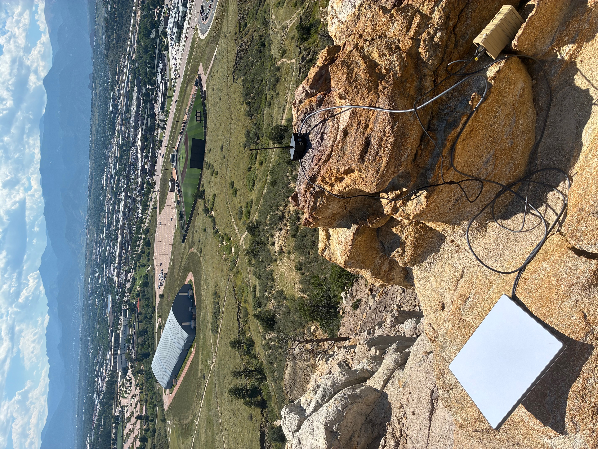
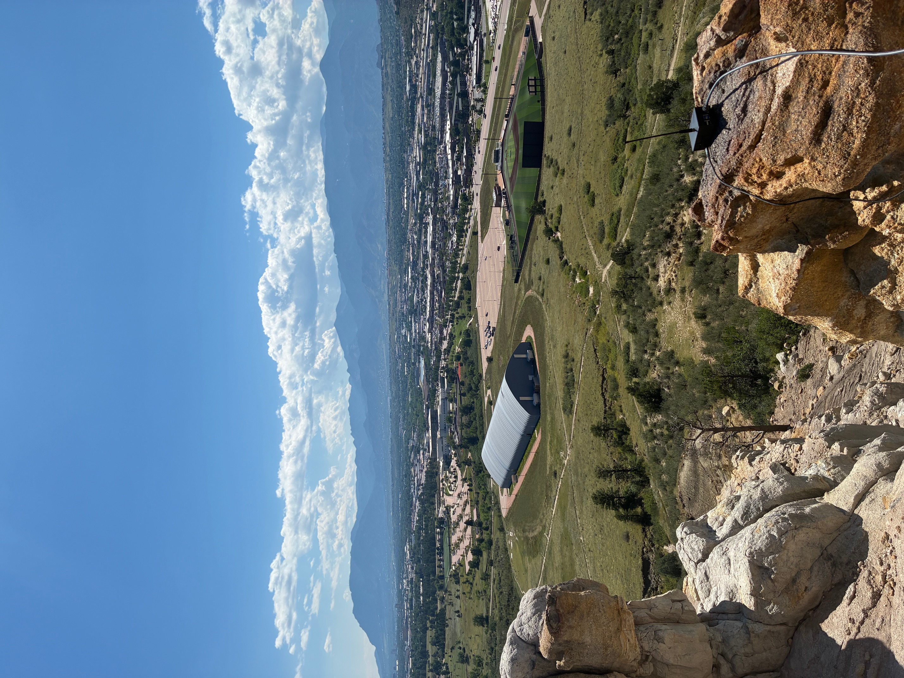
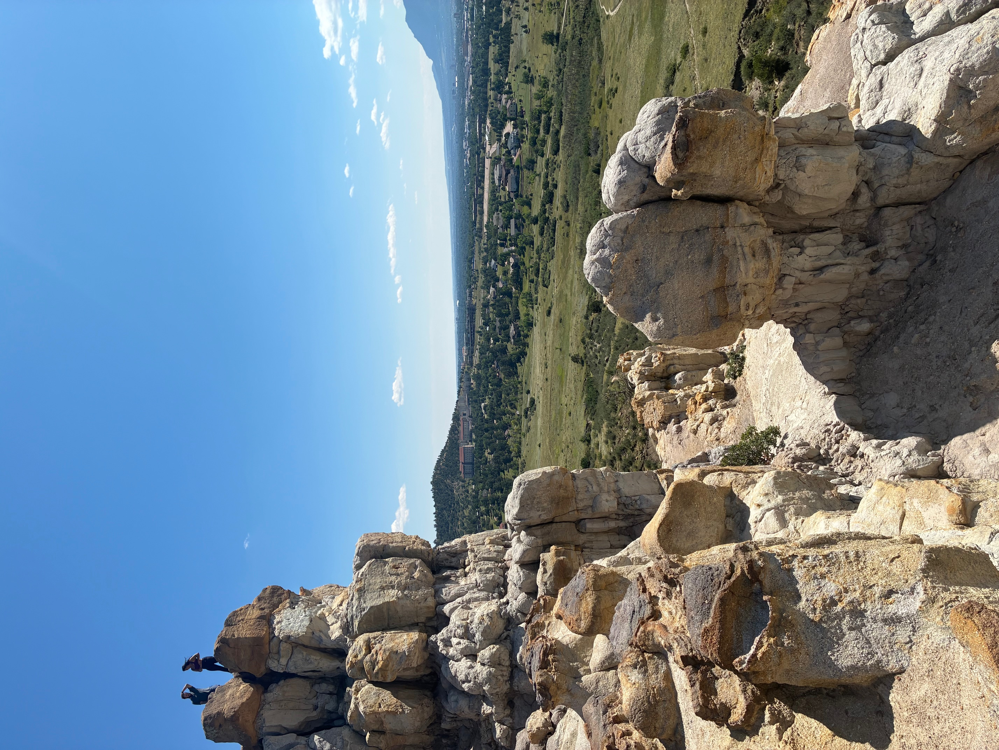
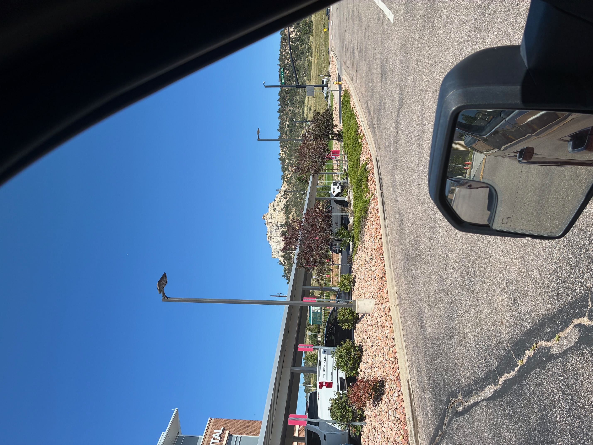
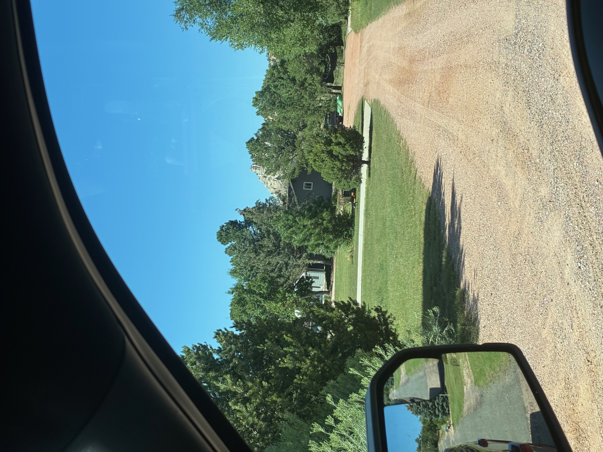
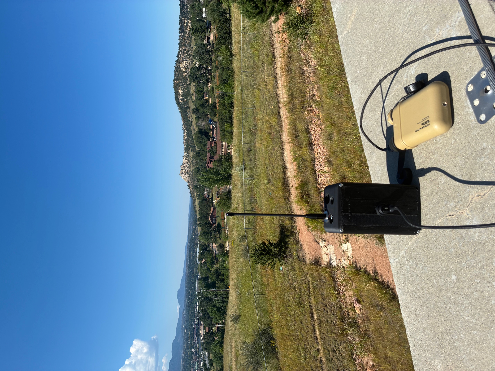

# Wi-Fi HaLow Range Testing — Pulpit Rock, Colorado Springs

This round of testing went pretty well overall. The setup was running on a **2 MHz channel (42 @ 923 MHz)** with just **two nodes** in the 802.11s mesh. Speeds were tested using the Google Speed Test app on my iPhone (should’ve used `iperf3`—next time).  

- **Local test (within 15 ft):** 4.03 / 4.27 Mbps  
- **With a 3rd node added:** 2.00 / 4.06 Mbps  

The **Starlink and Mesh Gateway** were staged on top of **Pulpit Rock** in Colorado Springs, with tests conducted at different spots around the rock. All tests used a **Muzi Works whip antenna**. I planned to compare another antenna but forgot them at home.  

Next round of testing will be with **multiple nodes** and on **1, 4, and 8 MHz channels**. When testing locally at 8 MHz, I hit **~15 Mbps**, so it’ll be interesting to see how that holds up at distance.

---

## Distance & Speed Results

| Location        | Distance (m) | Distance (mi) | Download (Mbps) | Upload (Mbps) |
|-----------------|--------------|---------------|-----------------|---------------|
| Parking garage  | ~1,548       | ~0.96         | 0.37            | 0.21          |
| Hospital        | ~619         | ~0.38         | 2.84            | 1.10          |
| Baseball lot    | ~669         | ~0.42         | 2.77            | 1.37          |
| Neighborhood    | ~1,038       | ~0.65         | 0.33            | N/A           |

## Test Images

### IMG_8480 — Equipment Setup
  
Equipment staged on top of Pulpit Rock, running the Wi-Fi HaLow mesh.

---

### IMG_8481 — View to Baseball Parking Lot
  
Looking out from the Rock toward the baseball lot, one of the test points.

---

### IMG_8482 — Parking Garage
  
View from the Rock to the parking garage, almost a mile away.

---

### IMG_8484 — Hospital View
  
Taken from the hospital parking lot, showing the Rock in the distance.

---

### IMG_8489 — Neighborhood View
  
Obstructed line-of-sight to the Rock from inside a neighborhood.

---

### IMG_8491 — Rock From Parking Garage
  
View of the Rock as seen from the parking garage test location.