# Setup batman-adv
B.A.T.M.A.N. advanced (often referenced as batman-adv) is an implementation of the B.A.T.M.A.N. routing protocol in form of a linux kernel module operating on layer 2.

B.A.T.M.A.N. is a proactive routing protocol for Wireless Ad-hoc Mesh Networks, including (but not limited to) Mobile Ad-hoc Networks (MANETs). The protocol proactively maintains information about the existence of all nodes in the mesh that are accessible via single-hop or multi-hop communication links. The strategy of B.A.T.M.A.N. is to determine for each destination in the mesh one single-hop neighbor, which can be utilized as best gateway to communicate with the destination node. In order to perform multi-hop IP-based routing, the routing table of a node must contain a link-local gateway for each host or network route. To learn about the best next-hop for each destination is all that the B.A.T.M.A.N. algorithm cares about. There is no need to find out or calculate the complete route, which makes a very fast and efficient implementation possible.

**Important: Follow the 802.11s Wizard through the WebUI BEFORE setting up batman-adv**

## Setup Server Gateway
The "Server" Gateway node type is used to uplink internet access or connect another non mesh network to your 802.11s mesh.  You will want to follow the 802.11s Mesh Wizard using the `Mesh Gate` mode.

Navigate to the LuCI web interface in your web browser, typically at http://10.42.0.1

From the sidebar menu goto **Network > Interfaces**

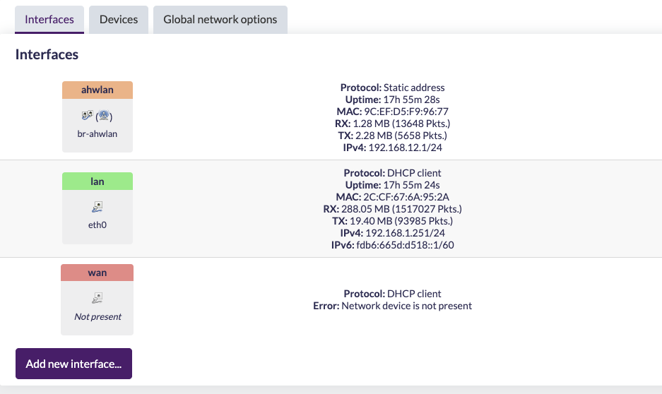

Click on **Add New Interface** Button

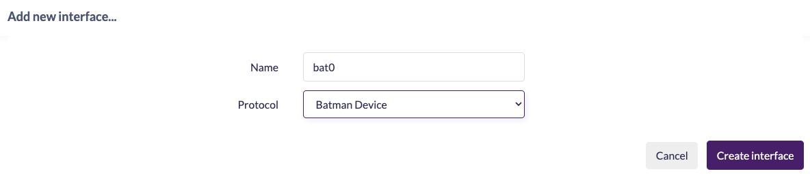

From the drop-down menu `Protocol` select `Batman Device`. Give the device a name like **bat0**. Then click Create interface. This will create a tunnel device called `bat0`. OSI Layer 2 packets/frames sent over the the tunnel will be routed using the batman protocol. Next, we will be prompted to configure some batman-specific options. You can edit these options again later by clicking the Edit button next to the bat0 interface.

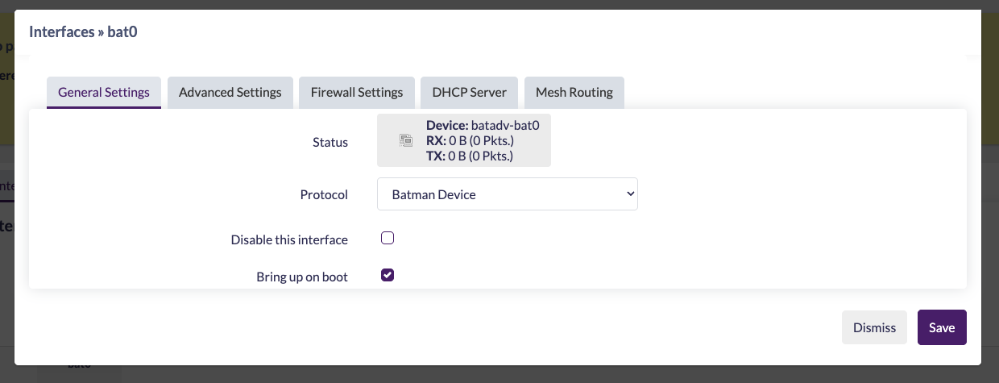

You can accept most of the default options. Navigate to the `Mesh Routing` tab to make a few recommended changes.

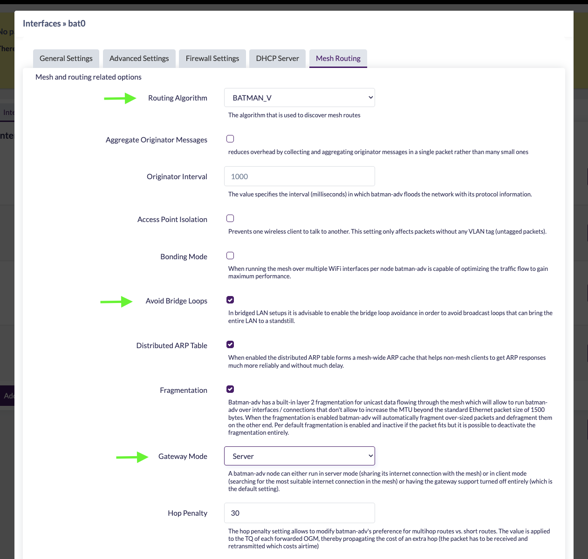

First, select the Routing Algorithm you want. You want to use BATMAN_V. All mesh nodes must be configured to use the same version of the batman protocol. Next, check the box to Avoid Bridge Loops. Set Gateway Mode to `Server` to explicitly tell batman that this router will be a gateway to the Internet. (Later, when configuring client nodes, we will set Gateway Mode to Client.)

Save your changes. You are finished setting up the bat0 device. Next we will create an alias interface for associating a radio with the batman mesh. Click Add new interface... again.

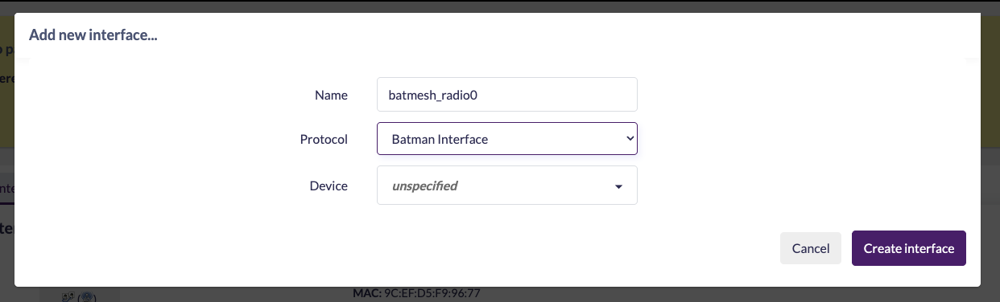

Select Batman Interface from the dropdown menu. Give the interface a name like batmesh. Important: do not associate the interface with a device in this menu. You will associate the interface with the bat0 batman device in the next step. For now, leave Device as unspecified and click Create Interface.

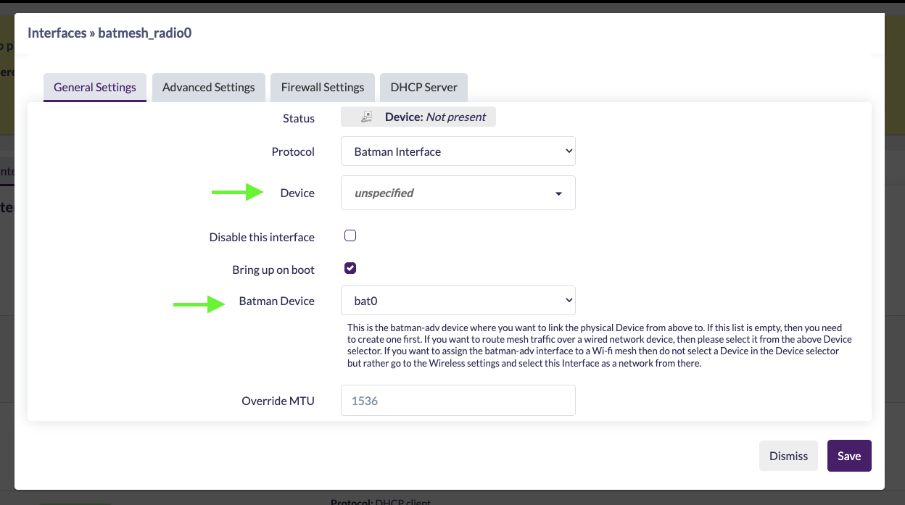

After you create the `batmesh_radio0` interface you will be prompted to configure its settings. Here you can set the Batman Device to bat0. You should not need to change any of the other default options.

`Save & Apply` your interface changes.

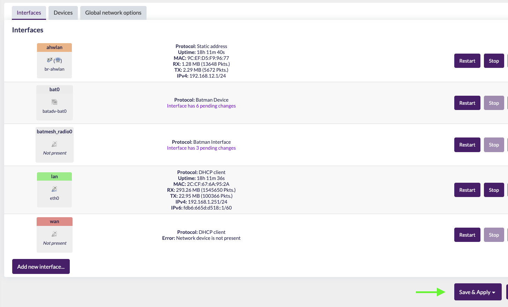

### Bridging batman to the mesh
You will most likely want to bridge the `bat0` tunnel interface with the halow network. This is required to have batman-adv handle all of the routing across the 802.11s network.

Navigate to `Network > Interaces` and then click on the `Devices` tab.

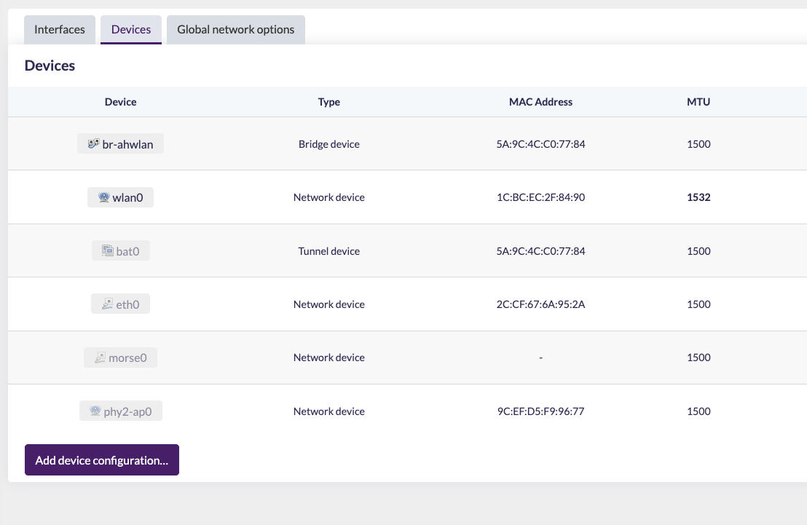

**Note**: if the `bat0` device does not appear in the list of devices and you have just created it in the previous step, you may have to click `Save & Apply` for the `bat0` device to actually be created. Once you can see the `bat0` device in the list, click the Configure... button next to the `br-ahwlan` bridge device.

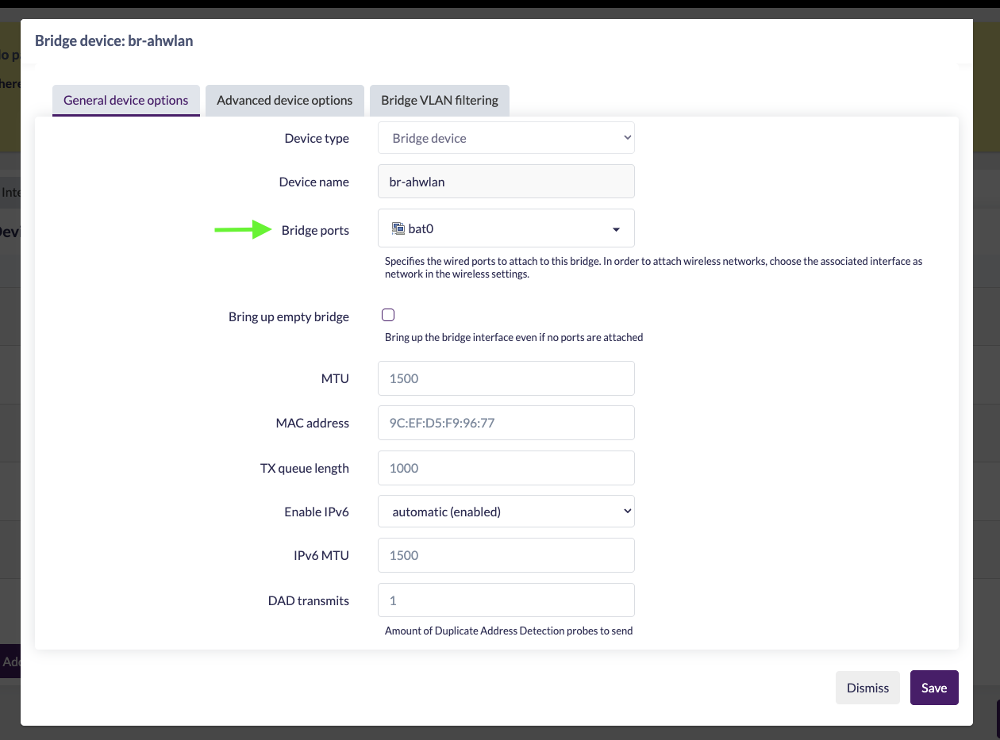

Check boxes next to the interfaces you want to be bridged. Due to an idiosyncracy of OpenWRT, you will not see any wireless interfaces here. Don't worry, we will connect them to the LAN in a later step. For now, as in this example, check the `bat0` device in addition to any lan ethernet ports. Then click `Save`.

### Configurating a radio for mesh

Navigate to `Network > Wireless`

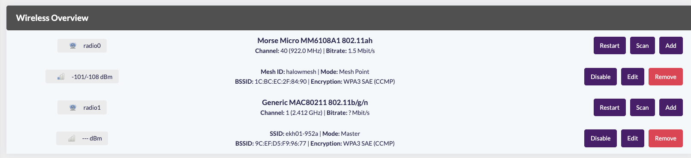

Create a **New** Wireless network on your 802.11ah wireless card.  This will most likely be the wireless card labeled `radio0`

Configure your mesh mode, Mesh ID, and the network to associate it with.  Mode should be `802.11s`, Your `Mesh ID` can be anything you want, but all nodes in your mesh **must** be the same `Mesh ID`.  Your network should be `batmesh_radio0` or whatever you called your interface.

You can also configure your operating frequency bandwith and channel from here.  **Your bandwidth and channel must match on all mesh nodes**

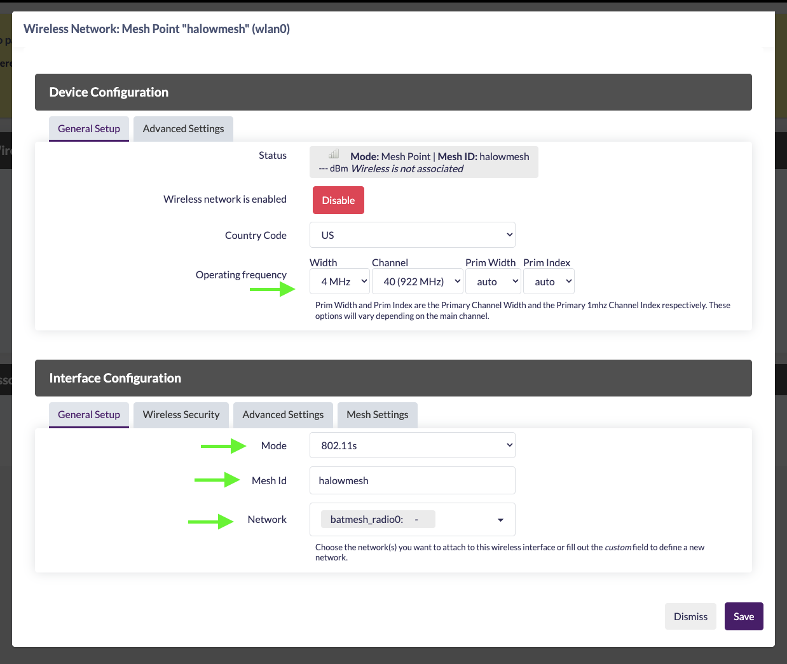

Click on the `Wireless Security` tab to configure your `Encryption` type and `Key`.  I strongly recommend using WPA3-SAE.

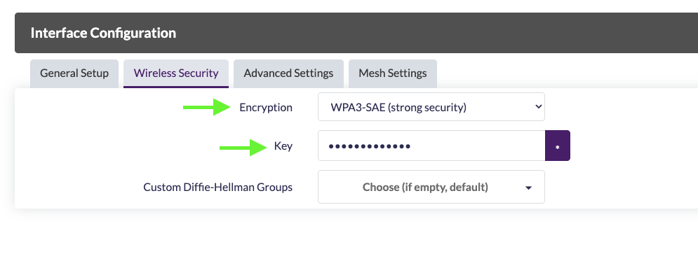

Click on the `Mesh Settings` tab.  You will want to **uncheck** `Forward mesh peer traffic`.  This is required to allow traffic to be routed by batman-adv.  You also want to check `Mesh Gate` since this is your gateway node.

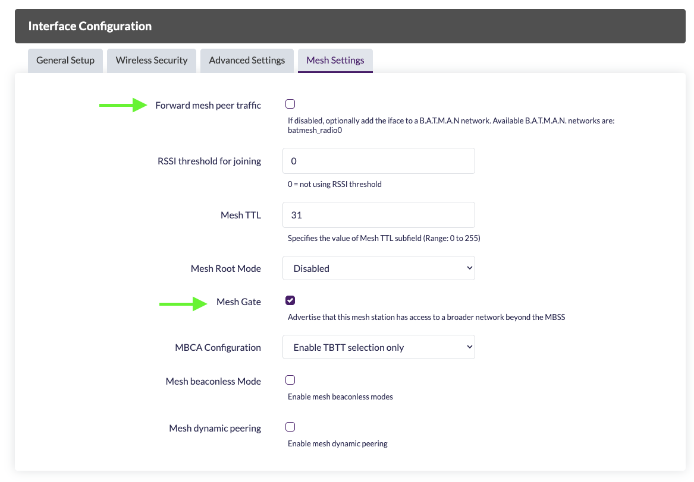

`Save & Apply` all of your settings.

## Setup Client Node
On your client node follow the 802.11s Mesh setup wizard for a `Mesh Point`

From the sidebar menu goto **Network > Interfaces**

Click on **Add New Interface** Button

From the drop-down menu `Protocol` select `Batman Device`. Give the device a name like **bat0**. Then click Create interface. This will create a tunnel device called `bat0`. OSI Layer 2 packets/frames sent over the the tunnel will be routed using the batman protocol. Next, we will be prompted to configure some batman-specific options. You can edit these options again later by clicking the Edit button next to the bat0 interface.

You can accept most of the default options. Navigate to the `Mesh Routing` tab to make a few recommended changes.

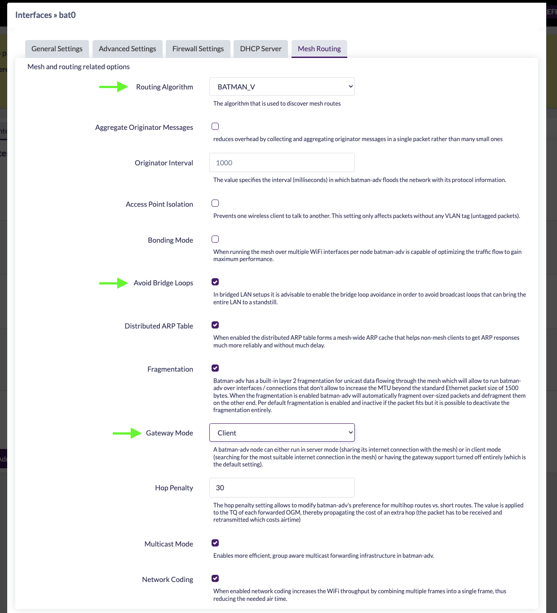

First, select the Routing Algorithm you want. You want to use BATMAN_V. All mesh nodes must be configured to use the same version of the batman protocol. Next, check the box to Avoid Bridge Loops. Set Gateway Mode to `Client` to explicitly tell batman that this is a client node.

Save your changes. You are finished setting up the bat0 device. Next we will create an alias interface for associating a radio with the batman mesh. Click Add new interface... again.

Select Batman Interface from the dropdown menu. Give the interface a name like batmesh. Important: do not associate the interface with a device in this menu. You will associate the interface with the bat0 batman device in the next step. For now, leave Device as unspecified and click Create Interface.

After you create the `batmesh_radio0` interface you will be prompted to configure its settings. Here you can set the Batman Device to bat0. You should not need to change any of the other default options.

`Save & Apply` your interface changes.

### Bridging batman to the mesh
You will most likely want to bridge the `bat0` tunnel interface with the halow network. This is required to have batman-adv handle all of the routing across the 802.11s network.

Navigate to `Network > Interaces` and then click on the `Devices` tab.

**Note**: if the `bat0` device does not appear in the list of devices and you have just created it in the previous step, you may have to click `Save & Apply` for the `bat0` device to actually be created. Once you can see the `bat0` device in the list, click the Configure... button next to the `br-ahwlan` bridge device.

Check boxes next to the interfaces you want to be bridged. Due to an idiosyncracy of OpenWRT, you will not see any wireless interfaces here. Don't worry, we will connect them to the LAN in a later step. For now, as in this example, check the `bat0` device in addition to any lan ethernet ports. Then click `Save`.

### Configurating a radio for mesh

Navigate to `Network > Wireless`

Create a **New** Wireless network on your 802.11ah wireless card.  This will most likely be the wireless card labeled `radio0`

Configure your mesh mode, Mesh ID, and the network to associate it with.  Mode should be `802.11s`, Your `Mesh ID` can be anything you want, but all nodes in your mesh **must** be the same `Mesh ID`.  Your network should be `batmesh_radio0` or whatever you called your interface.

You can also configure your operating frequency bandwith and channel from here.  **Your bandwidth and channel must match on all mesh nodes**

Click on the `Wireless Security` tab to configure your `Encryption` type and `Key`.  I strongly recommend using WPA3-SAE.

Click on the `Mesh Settings` tab.  You will want to **uncheck** `Forward mesh peer traffic`.  This is required to allow traffic to be routed by batman-adv.  You also want to check `Mesh Gate` since this is your gateway node.

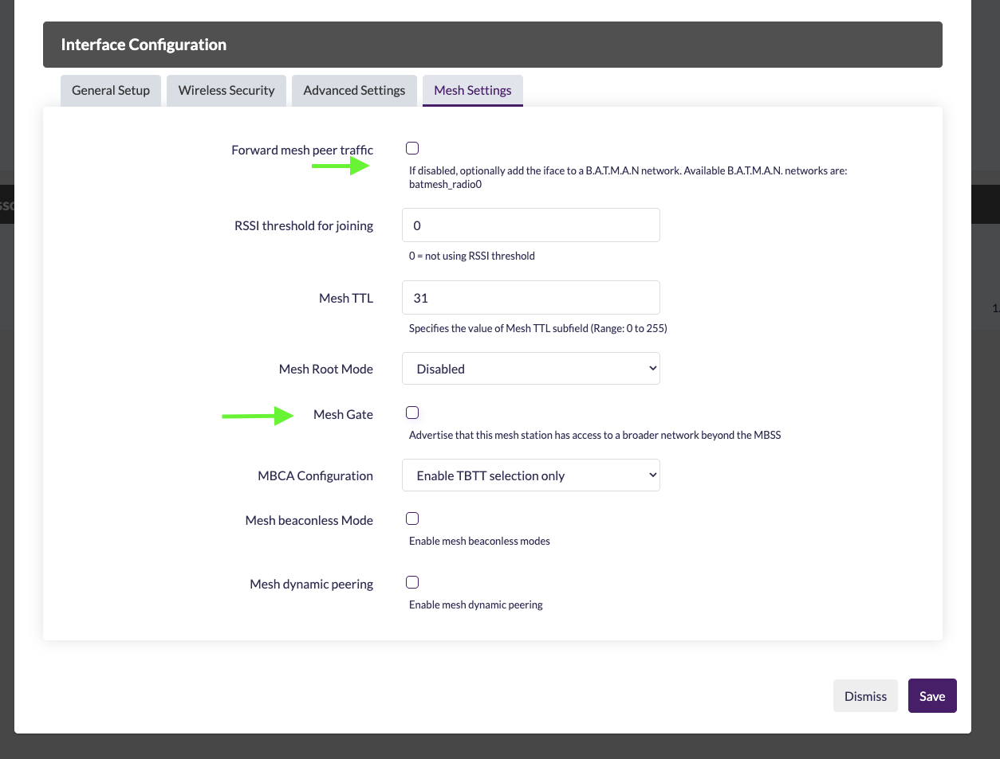

`Save & Apply` all of your settings.

Once you have both a server and client node configured and assuming they are in range you should see them automatically associate with each other and you have successfully created an 802.11s mesh with B.A.T.M.A.N ADV.  Congratulations!